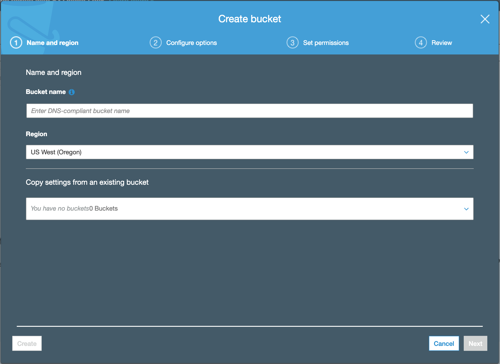

## XX.1 Lesson Plan - Introduction to AWS

### Overview

Today's lesson will introduce students to Amazon Web Services. Specifically, students will be learning how to upload and download data from S3 using the boto3 python library.

- - -

##### Instructor Priorities

* Students should be comfortable navigating to S3 from the Amazon Web Console.
* Students should understand how to upload/download files from S3 through the web console.
* Students should understand how to create S3 buckets using the boto3 python library.
* Students should understand how to upload/download files/data to a particular S3 bucket using the boto3 python library.

##### Instructor Notes

* Today's class will require a lot of upfront setup as student's will need to have AWS accounts set up in order to go through today's activities.
* It is expected that students should already be signed up for an AWS account at minimum as this was part of the pre-course installation steps.
* Setting up AWS credentials using the AWS CLI can be a little bit overwhelming for students so Instructor should cover this portion with extra attention to ensure students don't fall behind during this portion of the lecture.

### Class Objectives

* Students will be able to navigate the AWS navigation console.
* Students will be able to create S3 buckets from the AWS console.
* Students will be able to create S3 buckets programmatically using the boto3 library in python.
* Students will be able to programmatically load data into S3 as well as retrieve data stored in S3.

- - -

### 0. Instructor Do: Welcome Class (0:01)
- Take the first few minutes of class to welcome students back to class. Give them a heads-up that today's class will be an exciting one but that it will also require a decent amount of configuration at first.

### 1. Instructor Do: Introduction to AWS (0:05)

* What is AWS?
    * Amazon Web Services is a cloud services platform that provides Infrastructure as a Service. It offers computing power, object storage, database storage, and content delivery amongst many other services that make it easy for businesses to grow and scale.

    * While AWS has hundreds of services, today's class will focus on one of the most important and widely used services: S3

* Key points to explain to students why most companies that are on the cloud us S3 over Dropbox, Google Drive, etc...
    * Dropbox/Google Drive are consumer products that fixed storage tiers and have a monthly or yearly subscription-based billing model.
    * S3 has "on-the-go" pricing. Essentially pay for what you use billing structure.
    * S3 is also compliant with most legislation like GDPR or HIPAA.
    * S3 has different storage classes:
        * Frequent access tier (most expensive)
        * Infrequent Access tiers (mid-lever price)
        * Archival tier/cold storage (cheapest tier)
    * S3 has more customizable access policies as well as better encryption features

* For these reasons, S3 is a better storage option for corporate data backup and management.

### 2. Everyone Do: Introduction to AWS Management Console and S3 Setup (0:05)

* For the next few minutes, students will follow along with you as you walk them through setting up their first S3 bucket.
* Explain to students that the AWS Management Console is the online portal to hundreds of cloud-based services. It is the "landing page" for when you sign into AWS.
* Take a moment to explain the layout and how to search and navigate to a particular service.

* Inside the "Find Services" search bar, enter "s3" and click on the first result to go to the S3 page.
* To create an s3 bucket, click the "Create bucket" button which will pull up a dialog box.

* Take a moment to explain to students two key features:
    1. Similar to website domain names, S3 buckets must have DNS-compliant names. Essentially, the bucket name must be unique across all buckets that exist on AWS whether they are on your account or someone elses.
    2. Explain that the AWS infrastructure is built around geographical regions spread out across the globe. These regions serve to provide customers with the ability to build fault tolerant and low latency services -- amongst other features. As such, you must select a region in which your S3 bucket will reside. Generally, it is best to pick a region that is geographically closer to where each student is.

* While S3 buckets offer many features, all that is needed for now to create one is the unique DNS and a region. Once a bucket is created, you should see it available in your S3 console.

### 3. Everyone Do: Upload Sample Data (0:03)

* Lastly, we will upload a sample file into our newly created bucket.
* We will be uploading the sample csv file in [00-Evr_UploadSampleData](Activities/00-Evr_UploadSampleData/iris.csv).
* First, click on the bucket name inside the S3 Web Console
* Next, for organization sake create a new folder called "data".
* Click the newly created folder and once inside, just click on "Upload" which will open a dialog box that will allow you to chose the path to the file on your computer to upload to S3.
* Finally, S3 has a fairly new feature that allows you to preview files stored on S3. Click the file name in the folder. Click the "Select from" tab and then finally, near the bottom, click on the "Show file preview" button. Your result should look similar to the image below.

### 4. Everyone Do: Adding a User with Programmatic Access to S3 (0:10)

* Before we can start using the boto3 library which will allow us to use python to programmatically access our S3 buckets, we need to install the AWS Command Line Interface (CLI) so that we can set up our `credentials` configuration file. 
* This is the file that the boto3 library will check and pull API keys from in order to access your AWS account from your python programs which are run outside of your AWS account.
* Before we get started, we need to create these Access Keys which consist of an access key ID and secret access key.
* We need to create these keys from the AWS Management Console. In the Console, search for "IAM" inside the "Find services search box and click on "IAM".

* In the IAM Console, click "Users" and then click "Add user".

* Next, provide a user name and **ensure to tick the "Programmatic access" box. This is extremely important!!** Make sure to heavily emphasize that everyone has this box checked as the code examples will not work later on if this is not enabled.

* The next section is the "Set permissions section" where you are provided with 3 options at the top. Click on "Attach existing policies directly". In the search bar, type in "s3" and tick the "AmazonS3FullAccess" policy which is all the permissions this user will require to complete the assignments for today.

* Take a moment to explain to students that the point of this is to grant this new user the ability to fully access S3. By default, new users have no permission to do anything on AWS. You have to either assign the user to a pre-existing group with a pre-defined set of permissions, or manually enable what permissions the user has.

* The next screen is the "Review" section where you will review the options you have enabled for this new user. **Please ensure that everyone has "Programmatic access - with an access key" next to the "AWS access type".**

* Finally, click "Create user" which should pull up a "Success" dialog box that lets you view your Access key ID and Secret access key. **Ensure that students click the "Download.csv file" button to download a csv file that contains their access keys. This is extremely important as this will be the only time they will be able to see their access keys from the console so downloading the csv file is extremely important.**

### 5. Everyone Do: Install AWS CLI (0:08)

* Now that we have API access keys, we can move on to installing the AWS CLI. At this point, students may start to feel a little overwhelmed with all these configuration steps. Remind students that most of these steps are steps that need to be performed upfront when first getting started with AWS and before the actual fun can start.

* The next thing we want to do is open the terminal and run the following command as contained in the official AWS instructions [here](https://docs.aws.amazon.com/cli/latest/userguide/cli-chap-install.html).

    `pip3 install awscli --upgrade --user`

* **NOTE:** If students encounter trouble installing the `awscli` using `pip` or    `pip3`, AWS provides alternatives for installation:
    * For Linux/MacOS/Unix users: [click here](https://docs.aws.amazon.com/cli/latest/userguide/install-bundle.html)
    * For Windows users: [click here](https://docs.aws.amazon.com/cli/latest/userguide/install-windows.html#install-msi-on-windows)
    
* Once installation is complete, verify that `awscli` is installed correctly by running the following command:
`aws --version` which should return the latest version number.
* **NOTE:** If the installation of `awscli` using `pip/pip3` runs successfully but running `aws --version` results in a "bash: aws: command not found" error, then a potential solution is finding the path of where it was installed and adding that path to the `$PATH` environment variable. One way to find where `pip/pip3` installed the `awscli` packages is to run the following command:

    `python -c 'import awscli; print(awscli)'`

    * [Here](https://stackoverflow.com/questions/23332147/awscli-not-added-to-path-after-installation) is a link to a good resource to assist further with this solution.
    * [Here](https://unix.stackexchange.com/questions/26047/how-to-correctly-add-a-path-to-path) is a good resource for showing students how to add a path to their `$PATH` environment variable.

* The final step is to configure the AWS CLI and add our Access keys. Fortunately, this is a straightforward procedure. In the terminal, run the following command:
    
    `aws configure`
    
    * Official documentation on running this command can be found [here](https://docs.aws.amazon.com/cli/latest/userguide/cli-chap-configure.html)

* When you type this command, the AWS CLI prompts you for four pieces of information (access key, secret access key, AWS Region, and output format), and stores them in a profile (a collection of settings) named "default". This profile is then used by default any time you run an AWS CLI command -- or in our case a python program using boto3.

    
*  For the region section, enter a region that is geographically closest to you. It should be entered in the format as shown in the "region" column (2nd column) of [this](https://docs.aws.amazon.com/general/latest/gr/rande.html#s3_region) link.

    **NOTE:** This is just a snapshot of more available regions!

    

* Lastly, to verify that everything is working as expected, you should be able to run the following CLI command and see the S3 bucket you created in the earlier steps:

    `aws s3 ls`

### 6. Instructor Do: Create S3 Bucket using boto3! (0:05)

* Finally, the fun can begin! Open up [01-Ins_CreateS3Bucket](Activities/01-Ins_CreateS3Bucket) and run the code line-by-line with the class.

    * The only required library needed to interact with S3 is `boto3` but we will also be importing `uuid` from the standard library as well as `ClientError` from the `botocore.exceptions` library to get a more accurate error if one is to occur.

    * The first thing we need to configure is our connection to S3. The boto3 has two API versions: a client and a resource, but we will use the resource version as it slightly easier to work with and provides more than what we need for these activities.

    

    * Recall that S3 bucket names must be DNS compliant (aka have unique names). The `uuid` module will help us ensure we create unique names and avoid "bucket exists" errors. We still want our bucket to have some semblance of a given name, so we will prefix it with a name that describes its use.

    

    * Recall that creating S3 buckets also requires a region, but instead of hard-coding the region, we can extract it from our default profile with the following line of code:

    

    * With all these pieces, we can now create our S3 bucket. `s3` has a method called `create_bucket()` which has a required `Bucket` parameter that takes in a bucket name. We can also use the `CreateBucketConfiguration` that takes in a dictionary with additional configuration parameters. While this parameter is not required, it is good practice to use as we can define the region where our bucket is created, otherwise it will be created in the US Standard region by default.

    

    * While not mandatory, it is good to wrap this command in a `try/except` statement to gracefully catch any errors in creating our bucket. Given the code in the example, we print out the bucket name if it is created successfully, else an error if there is one.

### 7. Students Do: Students Create Their Second S3 Bucket using Python! (0:10)

* Now it's the students turn to create a new bucket using boto3.

* **File:**
    * [easy_buckets.ipynb](Activities/02-Stu_CreateStudentBucket/Unsolved/easy_buckets.ipynb)

    * **Instructions:**
        * Complete the code to:
            1. Establish a connection to S3
            2. Extract the AWS region
            3. Execute the `while` loop so that 4 new buckets are created in S3.
        
        * [Documentation](https://boto3.amazonaws.com/v1/documentation/api/latest/reference/services/s3.html#examples) for `boto3`
        * [Documentation](https://boto3.amazonaws.com/v1/documentation/api/latest/reference/services/s3.html#S3.Client.create_bucket) for `create_bucket()` method.

### 8. Instructor Do: Review Activity (0:05)

* Open the solution file [easy_buckets.ipynb](Activities/02-Stu_CreateStudentBucket/Solved/easy_buckets.ipynb)

* The beginning part of the solution should look almost identical to the instructor example in terms of setting up the S3 resource.

* Walk through the `while` loop and point out that:
    * In each iteration, we need a new unique identifier
    * In each iteration, the bucket name must be overwritten with the new bucket prefix and identifier
    * Similar to the instructor example, we wrap the `.create_bucket()` method in a `try/except` statement.

* The solution should look similar to the image below:

### 9. Instructor Do: Uploading Files to S3 (0:06)

* Open the Solved [uploading.ipynb](Activities/03-Ins_UploadingToS3/Solved/uploading.ipynb) jupyter notebook file.

* In this activity, we are going to show students how to use both the `upload_file()` method as well as the `put()` method to upload files, or byte data.

* The code for this example is slightly more involved as there is an intermediary step where we need to create a `s3.Object()` instance that takes in a bucket name and a "key" value which is essentially how we define the filename. It is *this* `s3.Object()` instance that actually has the `.upload_file()` and `.put()` methods that allow you to save data to S3 buckets.

    * **NOTE:** You may have noticed that for the "key" argument we passed in "data/iris.csv" as the "filename". The base filename will be called "iris.csv" in S3 but when we pass in keys that have a forward slash in them, the strings that prefix the base filename with a "/" will be interpreted as folder paths once uploaded to S3. So defining our key as "data/iris.csv" will upload "iris.csv" into a folder called "data" inside of the bucket name we passed in.

* Explain that the `upload_file()` method is used when you want to upload local files stored on your computer and that the `put()` method can be used to upload byte data that only exists while your current python program is running (like response data from an API call).

* The code below simply uploads a local file.

* In this example, we call a simple API and get a json response in our variable `data`. We then use the `json.dumps()` method to convert `data` from a python dictionary to a python object of type `str` which can be passed into the `Body` parameter of the `.put()` method. This will upload the string to a file defined as "iss_current_location.json" that will be nested inside of the "data" folder in our S3 bucket.

* Remember to point out that the `put()` method returns a dictionary response containing metadata about the status of the upload. An "HTTPStatusCode" of 200 means the upload was successful.

### 10. Students Do: Catch those Pokemon! (0:10)

* Now for a fun and more realistic example!

* **File:**
    * [gotta_catchem_all.ipynb](Activities/04-Ins_CatchingPokemon/Unsolved/gotta_catchem_all.ipynb)

* **Instructions:**

    * In this activity, students will:
        1. Create a dictionary containing pokemon names as the values and their associated API endpoint as the values
        2. Use a `for` loop to loop through the dictionary (HINT: the `.items()` method of a dictionary might come in handy).
        3. Upload the response data to an S3 bucket as you are going through your loop.
        4. Open up the S3 console in your browser to verify that the files have been uploaded.

### 11. Instructor Do: Review Activity (0:07)

* Open the solved [gotta_catchem_all.ipynb](Activities/04-Stu_CatchingPokemon/Solved/gotta_catchem_all.ipynb) jupyter notebook.

* Walk students through the high-points of the solution. In discussing the solution be sure to point out:

    * We can use the `for key, val in dict.items():` syntax to loop through a dictionary and get the key and the value.

    * In each iteration inside our for loop, we send a request to the API endpoint in the loop and store it in a variable as json.

    * In each iteration, we use the pokemon's name to name the file in the `key` variable.

    * In each iteration, we create a new `obj` variable of the `s3.Object()` instance and pass in the bucket and key. Then we use the `.put()` method to dump the json data in string format (using `json.dumps()`).

    

### 12. Students Do: Challenge! (0:25)

* The final challenge!

* **Files:**
    * [pokemon.csv](Activities/05-Stu_Challenge/Unsolved/data/pokemon.csv)
    * [transforming_and_uploading.ipynb](Activities/05-Stu_Challenge/Unsolved/transforming_and_uploading.ipynb)

* **Instructions:**
    * In this challenge activity, you will be tasked with opening a local file using the `pandas` library.
    * Modify the data by adding a new column called "above avg. strength" that contains boolean values to signal if a pokemon has a "Total" strength rating that is above average. For instance, if the average "Total" for all pokemon is 50 and the pokemon has a "Total" value of 65, then the value for "above avg. strength" would be `True`.
    * Use a [string buffer](https://docs.python.org/3/library/io.html#io.StringIO) to upload the `pandas` dataframe data as a csv *without* saving it back to your local machine. i.e. you will be using the `.put()` method to upload your dataframe as a csv file to S3 directly from your running program.

    * Hint: It may be useful to review the `df.to_csv()` documentation [here](https://pandas.pydata.org/pandas-docs/stable/reference/api/pandas.DataFrame.to_csv.html)

### 13. Instructor Do: Challenge Review (0:08)

* Open the solved [transforming_and_uploading.ipynb](Activities/05-Stu_Challenge/Solved/transforming_and_uploading.ipynb) jupyter notebook.

* Walk students through each cell and make sure to explain the following key points:
    * We create a new string buffer called `buffer` using the `StringIO()` class from the `io` module.

    * We used the `df.map()` method along, a `lambda` function, and a [ternary operator](http://book.pythontips.com/en/latest/ternary_operators.html) to quickly calculate the mean of the "Total" column and insert a `True` boolean value if the case was true, `False` otherwise.

    * We then used the `df.to_csv()` method to write the contents of the dataframe to the string buffer we created earlier which saves the data in-memory.

    * Finally, we extracted the csv data from the buffer using the `.getvalue()` method of the string buffer as we passed it into the `.put()` method for uploading to S3.

    * Final output looks similar to the image below:

    

    
